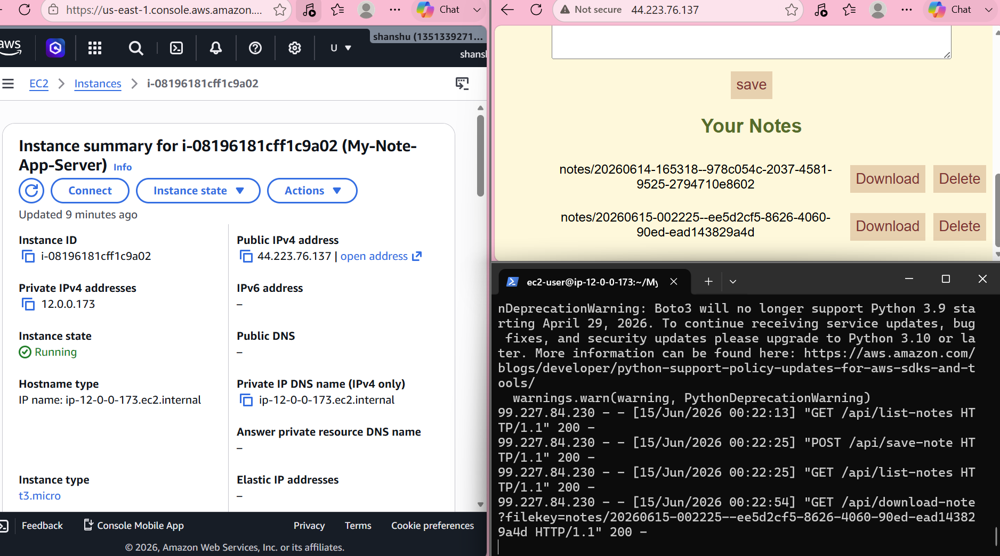

# EC2‑Hosted Cloud Note App
A cloud‑based note‑taking web application built with Flask, deployed on an AWS EC2 instance, and integrated with Amazon S3 for persistent storage. Users can create, upload, view, download, and delete text notes stored securely in the cloud.

🚀 Overview

This project demonstrates how to build and deploy a full web application on AWS using:

A Flask backend
A simple HTML/CSS/JS frontend
boto3 for AWS API interactions
EC2 for hosting the server
S3 for storing user‑generated notes
IAM for secure access control

The app provides a clean interface where users can write notes, upload them to S3, view a dynamic list of all saved notes, download any note, and delete notes from the cloud.

✨ Features
Create and upload notes to Amazon S3
Dynamic list of all stored notes
Download notes directly from S3
Delete notes from the cloud
Flask backend with REST endpoints
Deployed on AWS EC2
IAM‑secured S3 access
Lightweight UI using HTML, CSS, and JavaScript

🖼️ Screenshots

🛠️ Tech Stack
Python + Flask
HTML / CSS / JavaScript
AWS EC2
AWS S3
AWS IAM (least‑privilege role)
boto3

📦 Project Structure
project/
│
├── note_app.py
├── templates/
├── static/
├── screenshots/
└── README.md

🔮 Future Improvements
Add user authentication
Add HTTPS
Add database support
Add file versioning
Add a nicer UI

